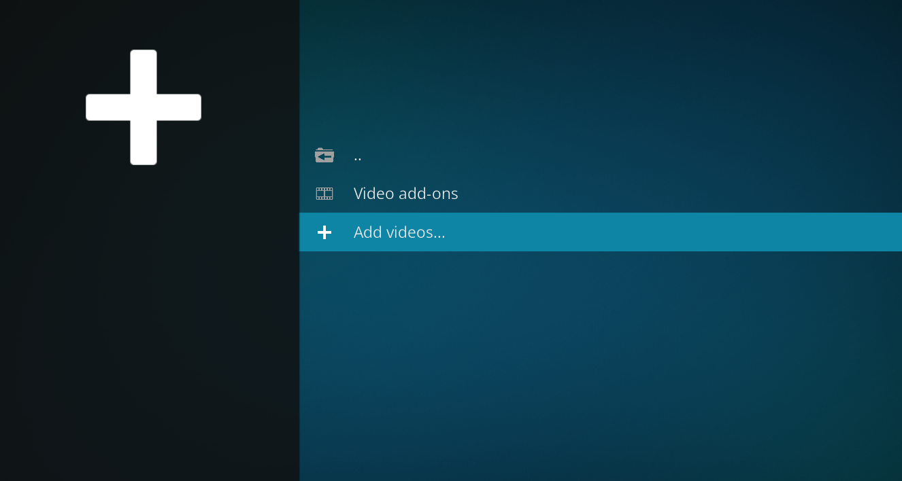
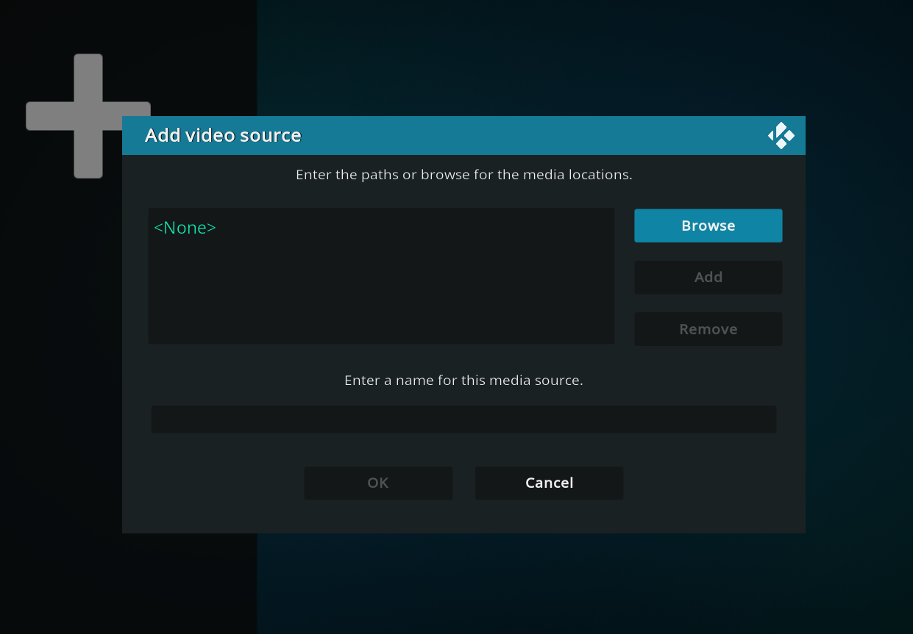
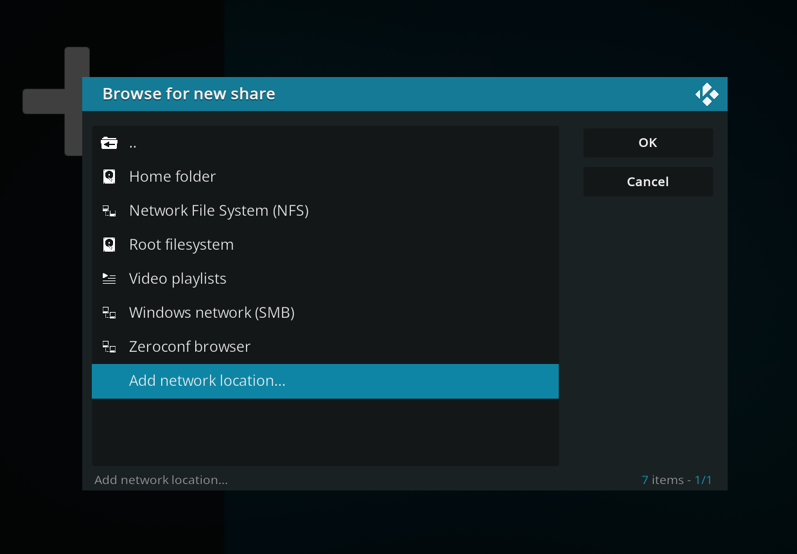
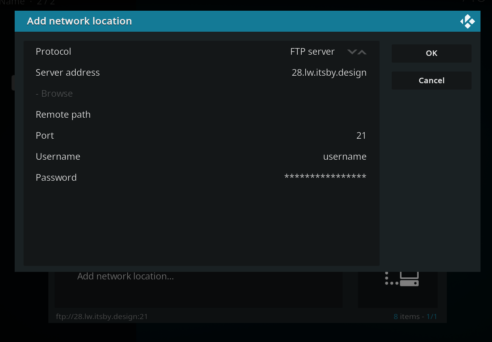

With these instructions, you can easily stream the content from your app slot via Kodi/XBMC.

Steps to set it up:

1. Select **Videos** in the Kodi main menu

2. Select **Files**

3. Select **Add Videos...**
 

4. Click the **Browse** button
 

5. Select **Add network location...** in the bottom
 

6. Fill out the fields as follows:

 

```plaintext
Protocol: FTP server
Server address: XXX.itsby.design (XXX is to be replaced with your app slot)
Remote path: files
Port: 21
Username: <app slot username>
Password: <app slot password>
```

7. Once filled out, click 'OK'

8. In the 'Enter a name for this media source', you can give source a description name such as **Media files**. Once done click the **OK** button

Now the **Media files** should appear as a file entry in the video source list. Simply click it, and you will have a complete view of the content of your app slot.

:::tip
**NOTES FOR USERS WITH BUFFERING**

In some cases you see short periods of buffering, the reason for this is that KODI is not caching any data but simply streaming as it needs to.

Sometimes you will have scenes where the need for data is higher than the speed you can download new material from the server, in those cases buffering will occur, to get around this it is possible to let KODI cache more data to avoid buffering in scenes which require a higher bandwidth.

You can read more about how to do it on the KODI website here: http://kodi.wiki/view/HOW-TO:Modify_the_video_cache
:::