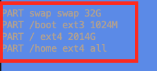

This tutorial will go over how to reinstall a Hetzner reinstall with a barebones OS, for example Debian 11 or Ubuntu 22.04. If you require the Swizzin Application Hosting package, please reach out to us via a [Ticket](https://my.hostingby.design/submitticket.php).

## Initiate Rescue Mode

:::tip Please Note 
Following this tutorial will remove ALL data from the service.
:::

Navigate to your customer portal and from the Left hand side Panel select Services and click on the Active Service you wish to reinstall. Click the Rescue button shown in the picture below.


You will then be asked to press Activate Rescue Mode. After pressing the button, the screen below will appear, showing you information about your Server. Copy the **Password** shown, as this will be your new **root** password.


Now press the **Back** button in the lower left corner of the window. When you're back at the next screen, you will see the **Status** of your server reads **Rescue Active** in red. Press the **Reboot** button and select **Execute an automatic hardware reset** and then press **Reboot**


Now you will have to wait for the server to reboot, this usually takes around 2-7 minutes. 

## Accessing installimage and reinstalling the Server.

    1. SSH to the server with the username **root** and the password shown in the Activate Rescue Mode window `ssh root@XXX.XXX.XXX.XXX`.
    2. Once you see the prompt root@rescue, simply type `installimage` to access the Hetzner installation wizard.
    3. Select your desired OS with your keyboards arrow keys and hit Enter, for example Debian.
	3.1. You will be asked to select the version of the OS you wish to install, select the desired version and press Enter.
    4. In this screen you will be able to adjust the installation settings, like RAID and Partitions. 

### Selecting RAID level

To enable RAID you must have **1** in the field where it says **SWRAID**. To select the RAID level, for example 0, 1, 5, 6, 10, you must input the RAID level number you want to use in the field labeled **SWRAIDLEVEL**. See the picture below for a RAID1 setup as an example.


### Partitions

Scroll down the screen with your arrow keys until you see the section below.



Here you can modify your partitions. What we typically do is we install everything on the Root partition, so modify the field to read:
```
PART swap swap 32G
PART /boot ext3 1024M
PART / ext4 all
```

Remove the part that says **PART /home ext4 all** and modify PART / ext4 XXXXM to read all instead.

:::note Please Note 
Only modify the last 2 fields here, do not modify the swap, /boot, /efi etc. fields unless you know what you are doing.
:::

After you have selected your RAID level and set up your Partitions, you can press F2 on your keyboard to save the config and then F10, click Yes to confirm the installation on all available Disks and let it run. 

The installation can take 5-10 minutes, sometimes even longer. So please just wait patiently until you see the `root@rescue` prompt again. Then just type `reboot` and press enter. Once the server is back up you will have a reinstalled OS on the machine. Your root password will be the same as the one you used to login to rescue mode. 

As always, if you have questions or issues with the reinstall process, please open a [Ticket](https://my.hostingby.design/submitticket.php)!
