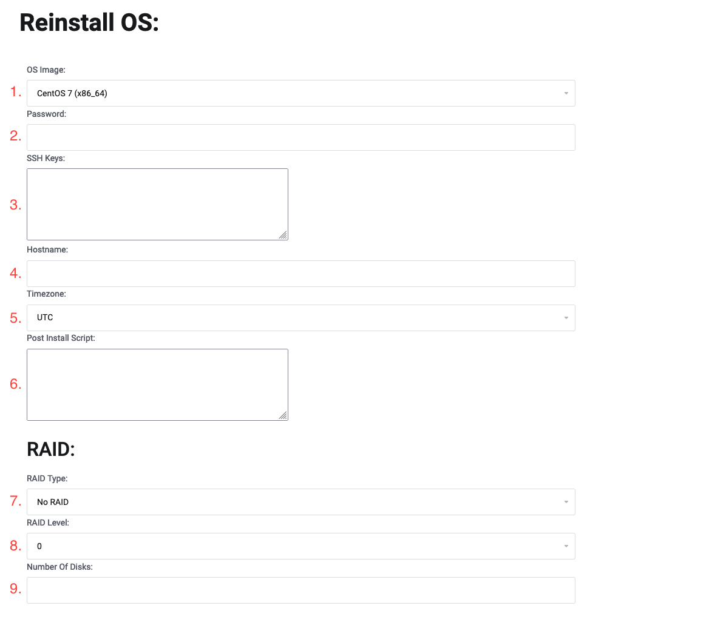
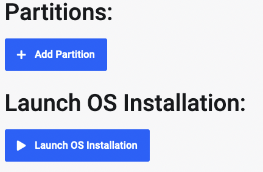

This tutorial will go over how to reinstall a Leaseweb reinstall with a barebones OS, for example Debian 11 or Ubuntu 22.04. If you require the Swizzin Application Hosting package, please reach out to us via a [Ticket](https://my.hostingby.design/submitticket.php).

## Initiate the reinstall

Navigate to your customer portal and from the Left hand side Panel select Services and click on the Active Service you wish to reinstall. Then click on the Reinstall OS button shown in the picture below.

:::tip Please Note 
This will remove ALL data from the service. Even if you have a NVMe+HDD or SSD+HDD hybrid machine, all data from the HDD's and SSD/NVMe will be deleted.


You will be asked to confirm you understand all data will be wiped, click Got It and go to the next step.

## Selecting the Operating System, RAID and Partitions

After confirming you understand your data will be removed, you will be shown the page below.



On here, you will be able to specify the Operating system etc. for your installation. 

Operating System:

1. For the OS Image, select the OS you wish to install, for example Ubuntu 22.04 or Debian 11.

2. The password field can be left blank so the installation will generate a password for you, or you can specify your own Root password the installation will use.

3. If you wish to add your own SSH key for the Root account, you can paste your key here.

4. If you wish to specify the hostname, you can specify it here. If blank, it will use the default hostname.

5. You can specify the Timezone here.

6. If you wish to run a script right after installation, for most, this field is best left blank.

RAID:

7. For the RAID type, select Software RAID if you wish to use RAID. If you wish to install the Operating System on one single disk and leave all others untouched, select No RAID.

8. For the RAID level select the level you wish to use. Most commonly 0 which will use Striping to give you the maximum available space, but no redundancy.

9. You can leave this field blank but for example if you have 4 hard drives and wish to have RAID0 on two of them and leave the other 2 untouched, input 2 here and it will use the first two disks for RAID0.

Partitions:



For Partitions, you can specify if you wish to use a different size root partition for example or less space for Swap. Typically you can just leave these blank and use the default settings. 
The Default Partitions are:

```
/boot ext2 1024MB

swap 4096MB

/tmp ext4 4096MB

/ ext4 all remaining disk space
```

## Launch OS Install

Click on the Launch OS Install button and this will start the reinstall process. Typically, it will take around 40-60 minutes for the Leaseweb installer to run through its steps. During this time, please do not try to reboot or access the machine, as this will break the process.

After the installer has finished, if you didn't specify a Password for the Operating System, you can find the password under Credentials for your service. It's labeled OPERATING_SYSTEM.
