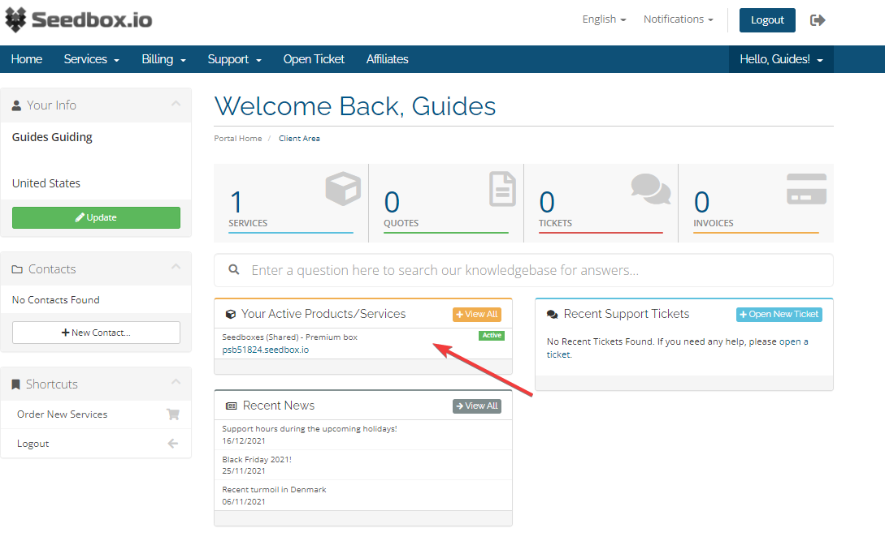
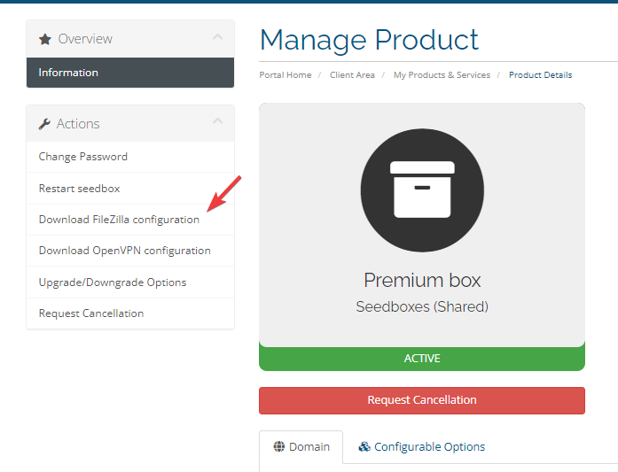
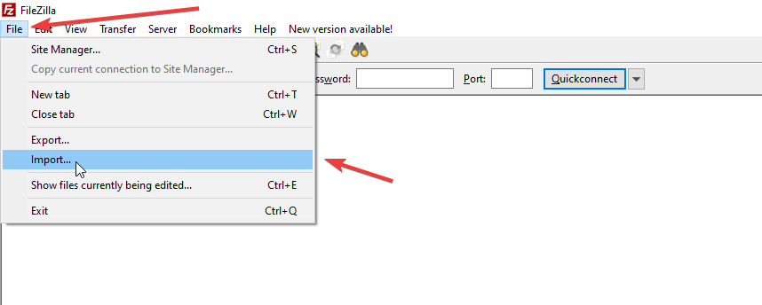
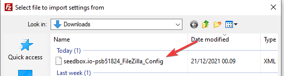
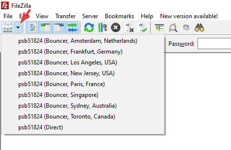

If you are having issues with slow download speeds via FTP, using one of our bouncer servers will often provide a better experience, we constantly add more bouncer servers to our inventory and add them into our FileZilla configuration..

We recommend using FileZilla, and starting here to get the basics of the program: [Connect to FTP](/shared-storage/file-access/connect-ftp)

To start using our bouncer services, first [login to your client area](https://panel.hostingby.design/clientarea.php?action=services) and click on your service.

:::caution
Please note that the screenshot points to the URL of the service, do not click on the URL but instead on the blank space next to the URL - Or click on the "Services" tab right above the service, and then click on the "Active" button.
:::

1. Go to the panel
 
 

2. Once there, click on the option **Download FileZilla configuration** in the **Actions** panel to the left. This will start the download of an XML file, this includes the bouncers and all needed information.

 

3. In FileZilla, in the top menu click **File -> Import**:

 

4. Once you click here, a popup window will appear, browse to the downloaded XML file and click **Open**.

 

5. Make sure that the **Site Manager entries** are ticked and then click **Ok**.

 To start using the bouncer, simply click on the little arrow next to the sitemanager:
 
 This will reveal all of our bouncer servers, simply pick the one closest to your location and you should see an improvement over the previous setup.

 

:::note
Do note, that even over the bouncer servers the FTP speeds may by a bit shaky, especially if you are in California or Australia where the data have to travel great distances as there is lots of unknown factors outside our network that we cannot control.
:::